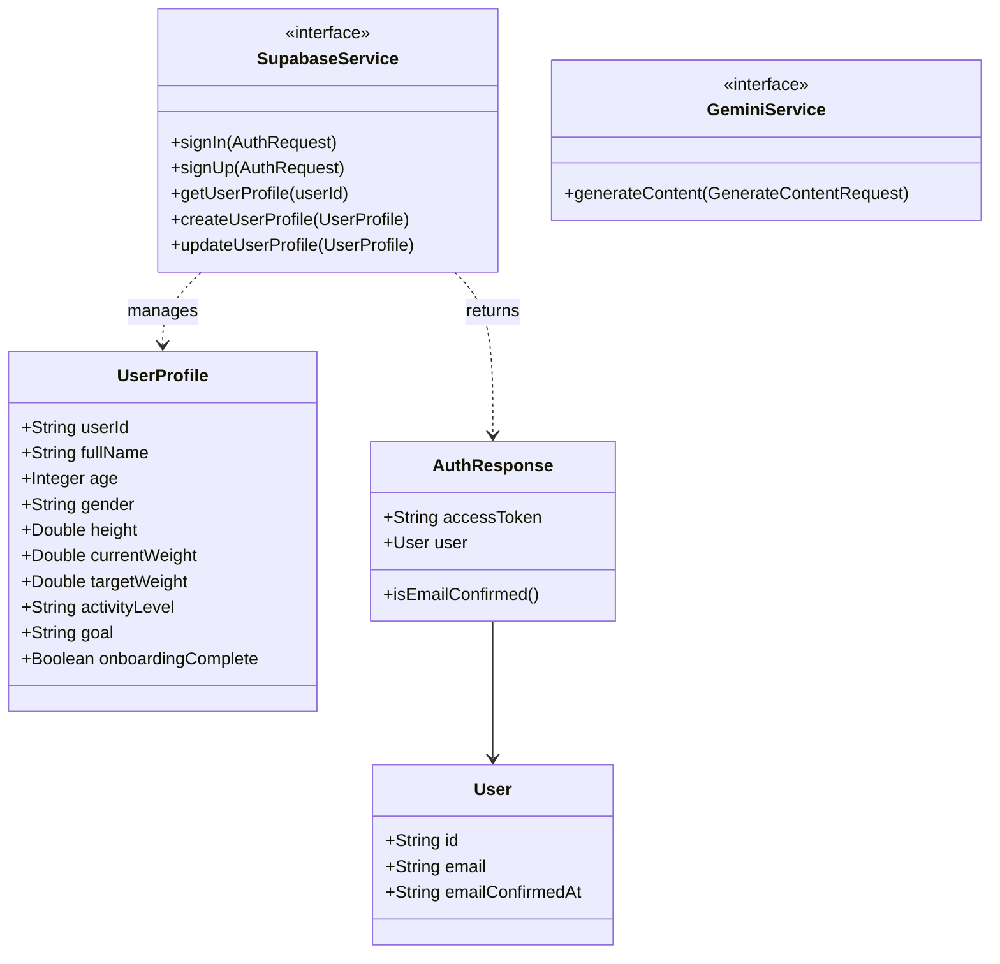
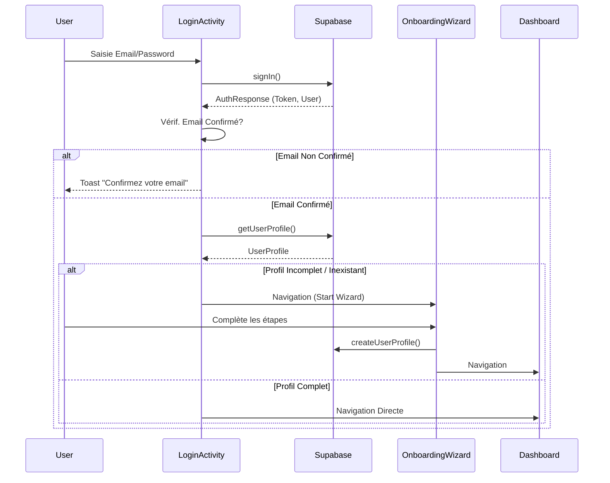
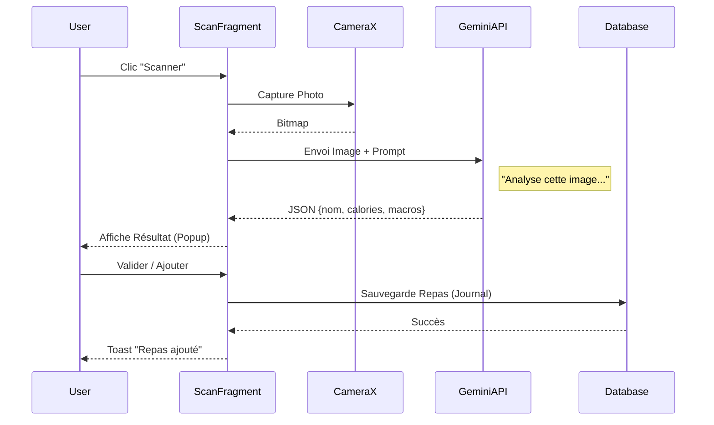

# ANNEXE VISUELLE : GUIDE DES CAPTURES ET DIAGRAMMES
## Pour accompagner le Rapport de Projet NutriSnap

Ce document sert de guide pour intégrer les éléments visuels dans votre rapport Word.

---

## 1. LISTE DES CAPTURES D'ÉCRAN À INCLURE

Prenez ces captures sur votre émulateur ou téléphone et insérez-les dans les sections correspondantes du rapport.

| Écran | Description | Section du Rapport |
| :--- | :--- | :--- |
| **1. Splash Screen** | L'écran de démarrage avec le logo NutriSnap. | 1.2. Présentation |
| **2. Welcome Screen** | Écran d'accueil (Login / Sign Up). | 4.3. UI/UX |
| **3. Login / Signup** | Formulaire de connexion ou d'inscription. | 4.1. Conception Fonctionnelle |
| **4. Onboarding (Wizard)** | Une étape du questionnaire (ex: Poids/Taille). | 4.1. Conception Fonctionnelle |
| **5. Dashboard** | Écran principal avec résumé calorique et boutons. | 4.3. UI/UX |
| **6. Scan (Camera)** | Aperçu de la caméra ou résultat d'analyse d'un plat. | 4.1. Conception Fonctionnelle |
| **7. AI Bro (Chat)** | Conversation avec l'assistant. | 3.3. Outils (IA) |
| **8. Journal** | Liste des repas enregistrés. | 4.1. Conception Fonctionnelle |
| **9. Jenkins Pipeline** | Capture de l'interface Jenkins montrant un build vert. | 6.2. Intégration Continue |

---

## 2. DIAGRAMMES TECHNIQUES (Code Mermaid)

Vous pouvez générer ces diagrammes via [Mermaid Live Editor](https://mermaid.live/) en copiant le code ci-dessous.

### A. Diagramme de Classes (Class Diagram)
*À insérer dans la section 4.2. Conception Technique*



### B. Diagramme de Cas d'Utilisation (Use Case Diagram)
*À insérer dans la section 4.1. Conception Fonctionnelle*

```mermaid
usecaseDiagram
    actor "Utilisateur" as U
    actor "Gemini AI" as AI
    actor "Supabase Auth/DB" as DB

    package NutriSnap_App {
        usecase "S'inscrire / Se connecter" as UC1
        usecase "Compléter Profil (Onboarding)" as UC2
        usecase "Scanner un Repas" as UC3
        usecase "Discuter avec AI Bro" as UC4
        usecase "Visualiser Dashboard" as UC5
    }

    U --> UC1
    U --> UC2
    U --> UC3
    U --> UC4
    U --> UC5

    UC1 --> DB : Authentification
    UC2 --> DB : Stockage Données
    UC3 --> AI : Analyse Image
    UC4 --> AI : Chatbot
    UC5 --> DB : Récupération Données
```

### C. Diagramme de Séquence : Login & Vérification
*À insérer dans la section 4.2. Conception Technique*



### D. Diagramme de Séquence : Scan de Repas (IA)
*À insérer dans la section 4.2. Conception Technique*


