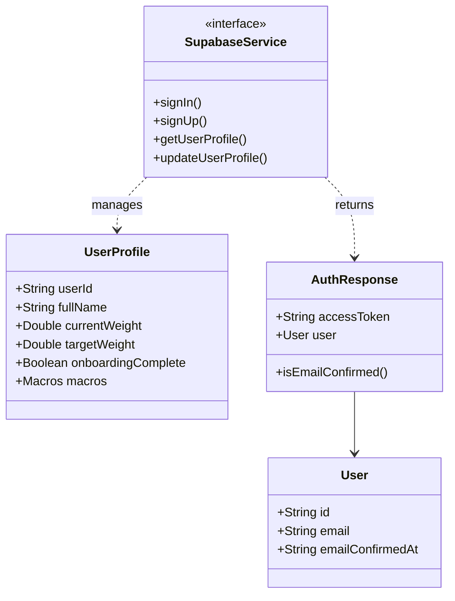
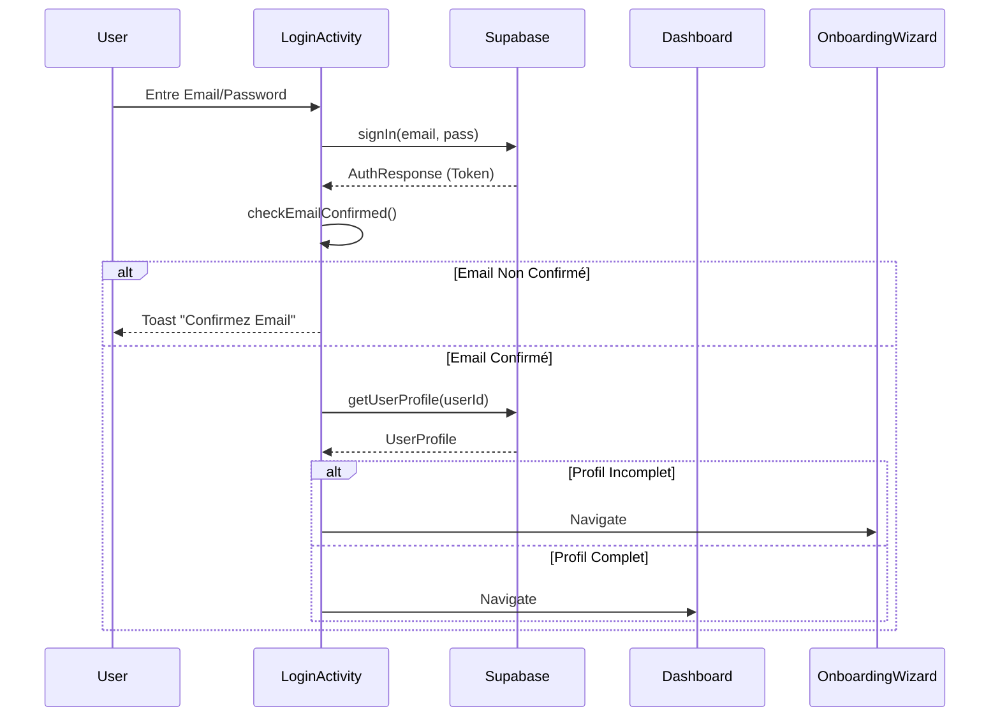
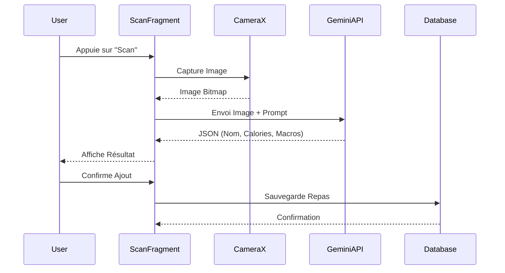

# GUIDE DES CAPTURES D'ÉCRAN ET DIAGRAMMES
## Pour le Rapport de Projet NutriSnap

Ce document détaille les éléments visuels à inclure dans votre rapport pour illustrer les sections techniques et fonctionnelles.

---

## 1. CAPTURES D'ÉCRAN (SCREENSHOTS)

Voici la liste des captures d'écran recommandées, où les prendre dans l'application, et dans quelle section du rapport les insérer.

### Comment prendre les captures :
*   **Via Android Studio** : Lancez l'application sur l'émulateur ou un appareil physique, ouvrez l'onglet **Logcat**, et cliquez sur l'icône d'appareil photo (Screen Capture) sur la gauche.
*   **Sur téléphone** : Utilisez la combinaison de touches habituelle (Volume Bas + Power).

### Liste des Captures :

| Nom de la Capture | Description | Où la trouver ? | Section du Rapport |
| :--- | :--- | :--- | :--- |
| **Splash Screen** | L'écran de démarrage avec le logo. | Au lancement de l'app. | 1.2. Présentation |
| **Welcome / Login** | Écran d'accueil avec boutons Login/Signup. | Premier écran après le Splash. | 4.3. UI/UX |
| **Onboarding Wizard** | Une des étapes du questionnaire (ex: Poids/Taille). | Après inscription ou login incomplet. | 4.1. Conception Fonctionnelle |
| **Dashboard** | L'écran principal avec le résumé calorique. | Après login réussi. | 4.3. UI/UX |
| **Scan Camera** | L'aperçu de la caméra pour scanner un plat. | Onglet "Scan" (menu bas). | 4.1. Conception Fonctionnelle |
| **AI Bro Chat** | Conversation avec l'assistant IA. | Onglet "AI Bro" (menu bas). | 3.3. Outils (IA) |
| **Journal** | Liste des repas enregistrés. | Onglet "Journal". | 4.1. Conception Fonctionnelle |
| **Jenkins Pipeline** | Vue du pipeline CI/CD avec les étapes vertes. | Interface Web de Jenkins (si disponible) ou schéma. | 6.2. Intégration Continue |

---

## 2. DIAGRAMMES TECHNIQUES

Vous pouvez générer ces diagrammes en utilisant des outils comme **Lucidchart**, **Draw.io**, ou en copiant le code **Mermaid** ci-dessous dans un éditeur compatible (comme Notion ou GitHub).

### A. Diagramme de Classes (Class Diagram)
*Section 4.2. Conception Technique*

Ce diagramme montre les relations entre les principales classes de données et l'authentification.



### B. Diagramme de Cas d'Utilisation (Use Case Diagram)
*Section 4.1. Conception Fonctionnelle*

Ce diagramme illustre les actions possibles pour l'utilisateur.

```mermaid
usecaseDiagram
    actor "Utilisateur" as U
    actor "Système IA (Gemini)" as AI
    actor "Backend (Supabase)" as DB

    package NutriSnap {
        usecase "S'inscrire / Se connecter" as UC1
        usecase "Compléter Profil (Onboarding)" as UC2
        usecase "Scanner un Repas" as UC3
        usecase "Discuter avec AI Bro" as UC4
        usecase "Consulter Journal" as UC5
    }

    U --> UC1
    U --> UC2
    U --> UC3
    U --> UC4
    U --> UC5

    UC1 --> DB : Vérification
    UC2 --> DB : Sauvegarde
    UC3 --> AI : Analyse Image
    UC4 --> AI : Génération Réponse
    UC5 --> DB : Lecture Données
```

### C. Diagrammes de Séquence (Sequence Diagrams)

#### 1. Séquence de Connexion et Vérification
*Section 4.2. Conception Technique*



#### 2. Séquence de Scan de Repas (IA)
*Section 4.2. Conception Technique*



---

## 3. INSTRUCTIONS POUR L'INTÉGRATION

1.  **Générez les images** :
    *   Prenez les captures d'écran sur votre téléphone/émulateur.
    *   Utilisez un outil comme [Mermaid Live Editor](https://mermaid.live/) pour copier-coller le code ci-dessus et télécharger les images des diagrammes (PNG ou SVG).
2.  **Insérez dans le Word** :
    *   Copiez le texte du fichier `RAPPORT_PROJET_NUTRISNAP.md` dans Word.
    *   Aux endroits indiqués (ex: Section 4.3), insérez vos images.
    *   Ajoutez une légende sous chaque image (ex: *Figure 1 : Diagramme de Séquence du Login*).
